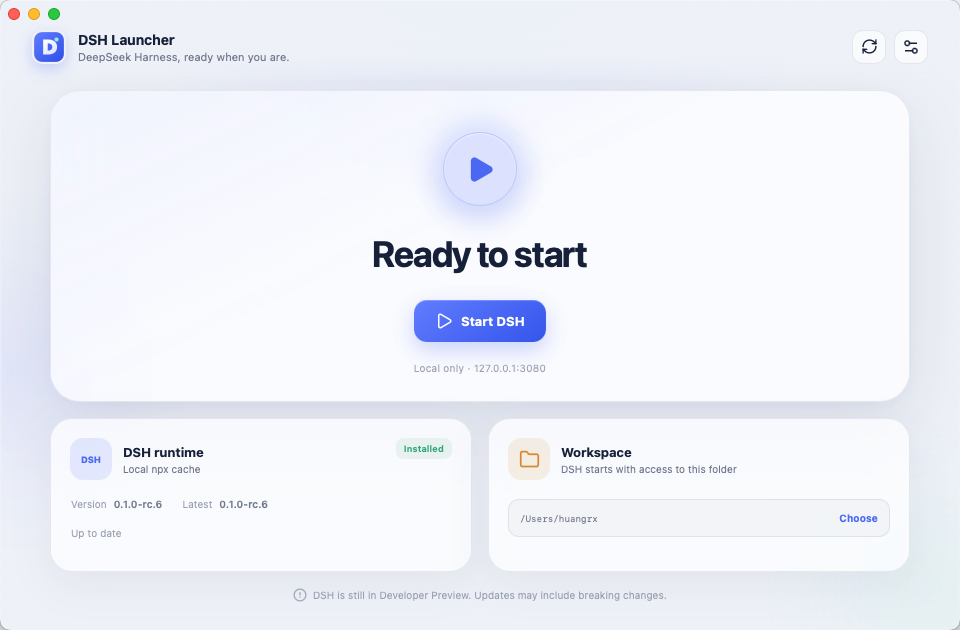

<div align="center">
  
  <h1>DSH Launcher</h1>
  <p>A lightweight desktop app for installing, updating, and controlling DeepSeek Harness Web.</p>
  <p>
    <a href="README.zh-CN.md">简体中文</a> ·
    <a href="https://github.com/minorsnownight/dsh-launcher/releases">Download</a> ·
    <a href="https://github.com/minorsnownight/dsh-launcher/issues">Report an issue</a>
  </p>
</div>

> [!IMPORTANT]
> DSH Launcher is currently a developer preview. It is an unofficial, community-maintained project and is not affiliated with or endorsed by DeepSeek.



## Why it exists

DeepSeek Harness Web is normally started with `npx @deepseek-ai/dsh web`. DSH Launcher brings installation, version checks, and process control into one desktop interface, so routine use does not depend on repeatedly entering a command.

## Features

- Detects app-managed, global npm, and npx-cached `@deepseek-ai/dsh` runtimes
- Checks npm for new versions and updates only with user confirmation
- Starts, opens, restarts, and stops the DSH Web service
- Manages verified DSH processes started from either a terminal or the launcher
- Lets you choose the working directory used to start DSH
- Refuses to terminate unrelated processes occupying port `3080`
- Supports macOS, Windows, Simplified Chinese, and English
- Supports light, dark, and system appearance

## Installation

Prebuilt installers will be published on [GitHub Releases](https://github.com/minorsnownight/dsh-launcher/releases). The current version can be run directly from source.

Node.js and npm must be available before DSH Launcher can run Harness. A runtime installed through the app is isolated in the application data directory: it does not alter global npm packages or require administrator privileges.

## Run from source

### Prerequisites

- Node.js and npm
- The stable Rust toolchain
- [Tauri 2 system dependencies](https://v2.tauri.app/start/prerequisites/)

```bash
git clone https://github.com/minorsnownight/dsh-launcher.git
cd dsh-launcher
npm install
npm run desktop
```

Build an installer for the current platform:

```bash
npm run dist
```

## How it works

DSH Launcher searches for a usable runtime in this order:

1. The launcher-managed runtime in the application data directory
2. A global npm installation
3. The local npx cache

The service runs at `http://127.0.0.1:3080`. If that port is occupied, the launcher inspects the listening process and only offers restart or stop controls when it can verify that the command belongs to `@deepseek-ai/dsh`.

The “working directory” is the current directory used when starting DSH. Harness reads and works with project files there. Stop the service before changing it.

## Privacy and safety

- No account system, telemetry, or analytics
- No silent DSH installation or updates
- No user-controlled strings interpolated into shell commands
- Service health checks stay on the local loopback address
- Unverified port owners are never terminated

## Development

```bash
npm run typecheck
npm test
npm run build
cargo test --manifest-path src-tauri/Cargo.toml
```

See [AGENTS.md](AGENTS.md) and [docs/PRODUCT.md](docs/PRODUCT.md) for project structure and product boundaries. Read [CONTRIBUTING.md](CONTRIBUTING.md) before submitting changes. Report security issues privately as described in [SECURITY.md](SECURITY.md).

## License

DSH Launcher is available under the [MIT License](LICENSE).

“DeepSeek” and related marks belong to their respective owners. This project only manages the user's local installation of `@deepseek-ai/dsh`; it does not include or redistribute that package.
